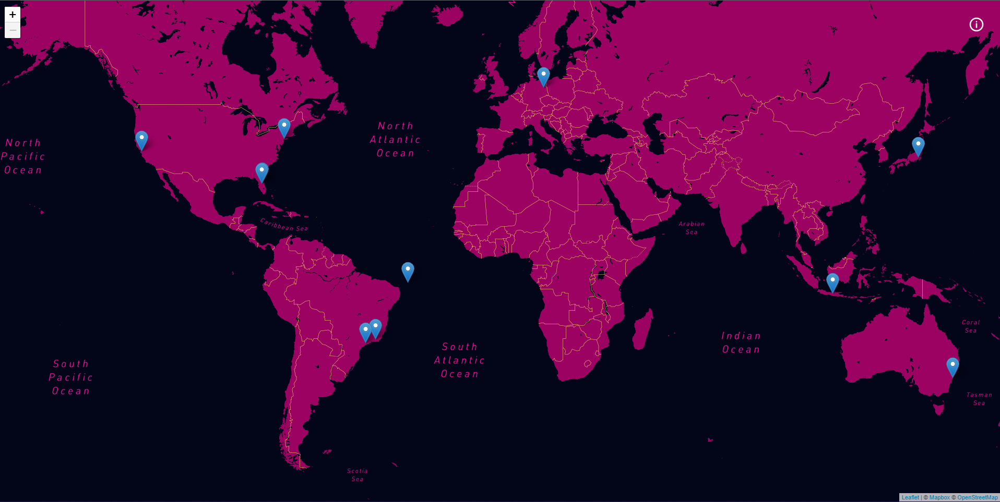

# A simple map app made in Next.JS 🗺️

## Your travel map
<br>

<p>
  
  
  
</p>


## Tópicos

[Sobre a aplicação](#sobre-o-my-trips)

[Funcionalidades](#funcionalidades)

[Tecnologias e Ferramentas](#tecnologias-e-ferramentas)

[Instalação e uso](#instalação-e-uso)


<br>

## My Trips 📌

O My Trips foi desenvolvido no intuito de praticar a criação de aplicações em Next.JS. Explorando algumas das suas pricipais funcionalidades como SSG e ISR, fazer requisições ao servidor utilizando a linguagem de consulta de dados GraphQL, entre outras. Além de fazer deploy da aplicação na Vercel.

<br>
Durante o desenvolvimento utilizei várias ferramentas fenômenais, para o desenvolvimento de aplicações web.
Todo o conteúdo é gerado de forma dinâmica, vindo de um genrenciador de conteúdo.

<br>

## cover da aplicação 🎨

<br>
<br>

## Funcionalidades ✨

- [X] Mapa
- [X] Rotas dinâmicas
- [X] Geração de páginas estáticas
- [X] Geração de páginas estáticas com revalidação
- [X] Ao clicar no marker você é redirecionado, para uma página onde mostra uma descrição(que é só de exemplo) com fotos do lugar em específico.

<br>

## Tecnologias e Ferramentas 🛠️

As seguintes tecnologias foram utilizadas no desenvolvimento do projeto:

- [HTML](https://devdocs.io/html/)
- [CSS](https://devdocs.io/css/)
- [JavaScript](https://devdocs.io/javascript/)
- [Typescript](https://www.typescriptlang.org/)
- [React Js](https://pt-br.reactjs.org/)
- [styled-components](https://styled-components.com/)
- [Jest](https://jestjs.io/pt-BR/)
- [React testing library](https://testing-library.com/docs/react-testing-library/intro/)
- [Storybook](https://storybook.js.org/)
- [Graphcms](https://app.graphcms.com/)
- [GraphQL](https://graphql.org/)
- [Leaflet](https://leafletjs.com/)
- [React Leaflet](https://react-leaflet.js.org/)

<br>

## Instalação e Uso :technologist:

Para rodar a aplicação, você precisa instalar o [Node](https://nodejs.org/en/)

Siga os passos abaixo:

```bash
# Abra um terminal e copie este repositório com o comando
$ git clone https://github.com/vitorSantanaDev/my-trips.git
# ou use a opção de download.

# Entre na pasta com
$ cd my-trips

# Instale as dependências
$ yarn

# Rode a aplicação
$ yarn dev
```

<br>

---

Feito com :yellow_heart: by [Vitor_Santana](https://github.com/vitorSantanaDev)

[](https://www.linkedin.com/in/vitor-santana-bbb607217/)
[](mailto:vitorsantana.developer@gmail)
